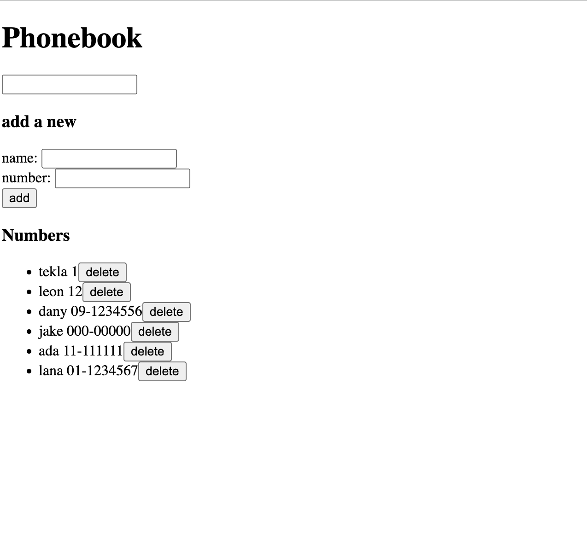

# Phonebook Fullstack

## Made for [fullstackopen](https://fullstackopen.com/) 

## Table of contents

- [Overview](#overview)
  - [The challenge](#the-challenge)
  - [Screenshot](#screenshot)
  - [Links](#links)
- [My process](#my-process)
  - [Built with](#built-with)
  - [Useful resources](#useful-resources)
- [Author](#author)

## Overview

### The challenge

Users should be able to:

- See saved contacts, save new ones, update existing ones and delete contacts.

### Screenshot

### Links

- Solution URL: [GitHub](https://github.com/tekla900/phonebook-fullstack)
- Live Site URL: [Fly.io](https://black-wind-8440.fly.dev/)

## My process

### Built with
- React
- JS
- Node.js
- MongoDB
- nodemon
- morgan
- Eslint
- Leaflet JS

### Useful resources
- [morgan](https://github.com/expressjs/morgan) - morgan logger middleware function documentation 

## Author

- GitHub - [Tekla Inashvili](https://github.com/tekla900)
- LinkedIn - [Tekla Inashvili](https://www.linkedin.com/in/tekla-inashvili-b95594232/)
